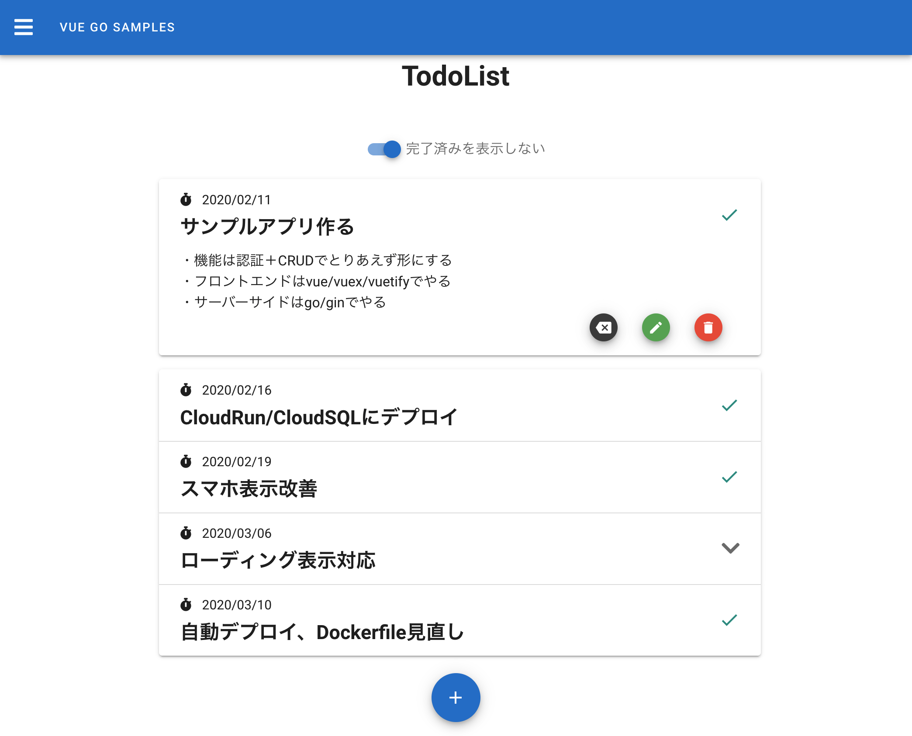

# vue-go-samples
Vue/Vuex + Go/Gin + MySQLを使ったサンプルアプリ

- Todolist

- Searcher

## Todolist



認証ありの簡単なTODOリストアプリ。

## Searcher


goroutine/channelを使った複数Webサービスを横断した検索アプリ。

## 技術スタック

### フロントエンド

- vue
- vuex
- vueRouter
- vuetify
- vuelidate

### サーバーサイド
- golang
- gin
- gorm
- gin-gwt
- sql-migrate

## セットアップ
```
$ git clone https://github.com/shinjiezumi/vue-go-samples.git
$ cd vue-go-samples
$ docker-compose up -d
$ docker-compose exec api bash
$ sql-migrate up
$ cp .env.example .env // Secretなどを設定
$ docker-compose exec front npm install
```

## サーバー起動

```
$ bash scripts/start-api.sh
$ bash scripts/start-front.sh
```

http://localhost:8080 開く

